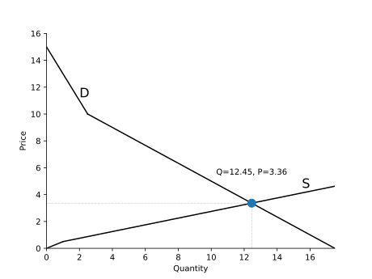

# Intro-Microeconomics

This is a package for introductory microeconomics topics. Find additional code, albeit unpackaged, in the loose-code branch. This new refactor does not yet have all of the same capabilities as in the old unpackaged code. 

# Example Usage

`Demand` and `Supply` objects can be created in several ways, but most naturally with the `from_formula` class method. The method requires an explicit slope, so `"P=12-1*Q"` or `"P=12-1Q"` must be used instead of `"P=12-Q"`.

```
from freeride.curves import Demand, Supply
d1 = Demand.from_formula("Q = 10 - 1*P")
d2 = Demand.from_formula("P = 15 - 2*Q")
s1 = Supply.from_formula('Q = 2*P')
s2 = Supply.from_formula('Q = 2*P - 1')
```

The addition operator performs horizontal summation, allowing aggregation.

```
d = d1 + d2
s = s1 + s2
```

Then you can solve for and plot an equilibrium.

```
from freeride.equilibrium import Equilibrium
e = Equilibrium(d, s)
print(e.p, e.q)
e.plot()
```

Use matplotlib to customize plots further. 

```
import matplotlib.pyplot as plt

ax = e.plot()
ax.set_ylim(0, 16)

# Label curves
ax.text(2, d(2) + 0.05,
        s='D',
        fontsize=16,
        horizontalalignment='left',
        verticalalignment='bottom')

ax.text(16, s(16) + 0.05,
        s='S',
        fontsize=16,
        horizontalalignment='right',
        verticalalignment='bottom')

# Label equilibrium
ax.text(e.q, e.p + 2,
        s=f'Q={e.q:.2f}, P={e.p:.2f}',
        horizontalalignment='center',
        verticalalignment='bottom')

plt.savefig("equilibrium.svg", transparent=True)
plt.show()
```


