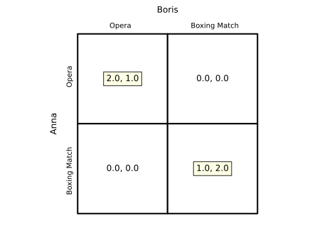

Games
=====

.. automodule:: freeride.games
    :members:
    :undoc-members:
    :show-inheritance:

Highlighting Options
--------------------

``Game.table`` accepts a ``usetex`` argument. When set to ``True`` the
underlying text is rendered with LaTeX and best responses are underlined.  When
``False`` (the default), best responses are indicated with colored boxes and no
raw ``\underline`` appears in the output.

Example::

    import matplotlib.pyplot as plt
    from freeride.games import Game

    p1 = [[3, 0], [5, 1]]
    p2 = [[3, 5], [0, 1]]
    g = Game(p1, p2)
    ax = g.table(usetex=False)
    plt.close(ax.figure)

Battle of the Sexes Example
---------------------------

``Game`` comes with constructors for common games.  The ``battle_of_the_sexes``
method returns the classic coordination game with players ``Anna`` and ``Boris``
and actions ``Opera`` and ``Boxing Match`` already labeled.  The table below was
created with ``usetex=False`` so that best responses are highlighted with
colored boxes.

In this version, Boris prefers the boxing match while Anna prefers the opera.

.. code-block:: python

    from freeride.games import Game

    ax = Game.battle_of_the_sexes().table()
    ax.figure.savefig("battle_of_the_sexes.svg", transparent=True)

