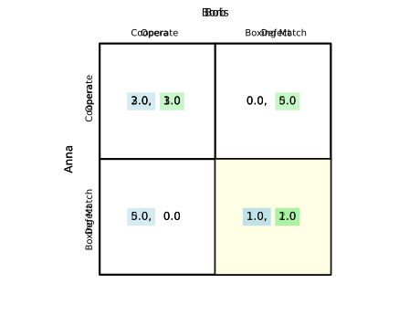
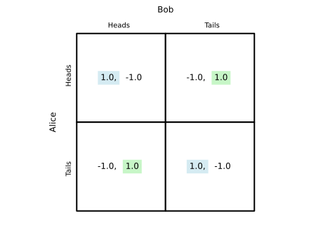
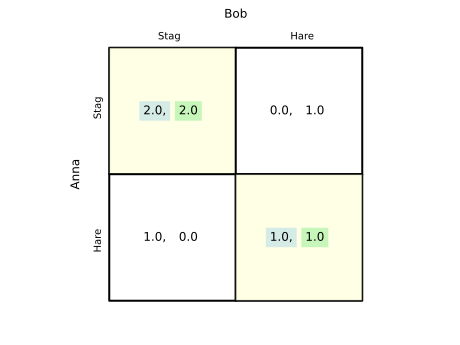
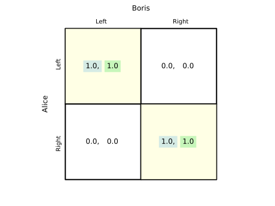
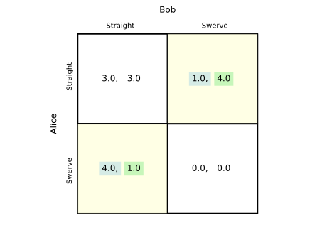

Games
=====

.. automodule:: freeride.games
    :members:
    :undoc-members:
    :show-inheritance:

The :class:`Game` constructor randomly assigns the row player the name
``Anna`` or ``Alice`` and the column player ``Boris`` or ``Bob`` when no
names are supplied. The built-in constructors such as
``prisoners_dilemma`` and ``matching_pennies`` also label the available
actions so that tables and other output are more informative out of the box.

Highlighting Options
--------------------

``Game.table`` accepts a ``usetex`` argument. When set to ``True`` the
underlying text is rendered with LaTeX and best responses are underlined.  When
``False`` (the default), best responses are indicated with colored boxes around
the payoff of the player with the best response and no raw ``\underline``
appears in the output.

Example::

    import matplotlib.pyplot as plt
    from freeride.games import Game

    p1 = [[3, 0], [5, 1]]
    p2 = [[3, 5], [0, 1]]
    g = Game(p1, p2)
    ax = g.table(usetex=False)
    plt.close(ax.figure)

Battle of the Sexes Example
---------------------------

``Game`` comes with constructors for common games.  The ``battle_of_the_sexes``
method returns the classic coordination game with players ``Anna`` and ``Boris``
and actions ``Opera`` and ``Boxing Match`` already labeled.  The table below was
created with ``usetex=False`` so that best responses are highlighted with
colored boxes on the payoff entries themselves.

In this version, Boris prefers the boxing match while Anna prefers the opera.

.. code-block:: python

    from freeride.games import Game

    ax = Game.battle_of_the_sexes().table()
    ax.figure.savefig("battle_of_the_sexes.svg", transparent=True)
    plt.close(ax.figure)

.. image:: battle_of_the_sexes.svg
   :align: center
   :alt: Battle of the Sexes payoff table

Prisoner's Dilemma Example
--------------------------

The prisoner's dilemma captures the tension between individual and collective
interest. Mutual cooperation is Pareto efficient but each player has an
incentive to defect.

.. code-block:: python

    from freeride.games import Game

    ax = Game.prisoners_dilemma().table()
    ax.figure.savefig("prisoners_dilemma.svg", transparent=True)
    plt.close(ax.figure)

Matching Pennies Example
------------------------

Matching pennies is a zero‑sum game with no pure strategy equilibrium. Each
player wants to match or mismatch the other's choice.

.. code-block:: python

    from freeride.games import Game

    ax = Game.matching_pennies().table()
    ax.figure.savefig("matching_pennies.svg", transparent=True)
    plt.close(ax.figure)

Stag Hunt Example
-----------------

The stag hunt models coordination with a safe action (hunting hare) and a
potentially higher payoff from mutual cooperation (hunting stag).

.. code-block:: python

    from freeride.games import Game

    ax = Game.stag_hunt().table()
    ax.figure.savefig("stag_hunt.svg", transparent=True)
    plt.close(ax.figure)

Pure Coordination Example
-------------------------

This simple coordination game rewards players for choosing the same action.

.. code-block:: python

    from freeride.games import Game

    ax = Game.pure_coordination().table()
    ax.figure.savefig("pure_coordination.svg", transparent=True)
    plt.close(ax.figure)

Chicken Example
---------------

The game of chicken (or hawk–dove) illustrates the conflict between standing
firm and yielding.

.. code-block:: python

    from freeride.games import Game

    ax = Game.chicken().table()
    ax.figure.savefig("chicken.svg", transparent=True)
    plt.close(ax.figure)

