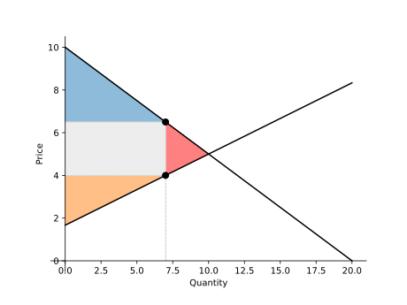

Welcome to FreeRide
===================

FreeRide is a Python package designed specifically for **introductory microeconomics**. 
Built with simplicity in mind, it provides intuitive tools for modeling economic 
concepts that "just work" the way economics students expect them to.

.. raw:: html

   

      <h3>🎯 Designed for Economics 101</h3>
      
Every feature is crafted with introductory economics in mind. The focus is on simple cases, like linear or piecewise-linear demand curves, that illustrate key concepts.

   

   

      <h3>✨ Intuitive by Design</h3>
      
Clean, readable code that matches conventional notation. Operations like <code>a + b</code> 
      for demand curves naturally perform horizontal summation.

   

   

      <h3>📊 Learn Visually</h3>
      
Plotting capabilities are emphasized. Every plot looks like it belongs in an economics textbook. Clean axes, automatic equilibrium highlighting, and thoughtful styling make your analysis shine.

   

Installation
------------

Install FreeRide using pip:

.. code-block:: bash

   pip install freeride

**Where to run this:**

- **Mac**: Open Terminal (found in Applications → Utilities)
- **Windows**: Open Command Prompt (search "cmd" in Start menu)
- **Both**: Or use Anaconda Prompt if you have Anaconda installed

**New to Python?** We recommend starting with `Google Colab <https://colab.research.google.com/>`_, 
which provides a free Python environment in your browser. No installation required - just run 
``!pip install freeride`` in a code cell.

Quick Example
-------------

.. code-block:: python

   from freeride import Demand, Supply
   
   # Create supply and demand curves
   demand = Demand.from_formula("Q = 20 - 2*P")
   supply = Supply.from_formula("Q = -5 + 3*P")
   
   # Find equilibrium using the intersection operator
   market = demand & supply
   
   # Beautiful plot with shaded surplus
   market.plot(surplus=True)

   # Inspect the equilibrium
   print(market)  # shows price and quantity
   print(market.consumer_surplus)
   print(market.producer_surplus)

**Output:**

.. code-block:: text

   Market(price=5.0, quantity=10.0)
   25.0
   37.5

The plot shows the supply and demand curves with the equilibrium point clearly marked, 
and the consumer and producer surplus areas shaded:

Basic Tax Example
-----------------

We can easily add a tax to the market and visualize its effects.

.. code-block:: python

   # Apply a $2.50 tax
   market.tax = 2.5
   market.plot(surplus=True)

This plot shows the higher price paid by consumers, the lower price
received by producers, and the shaded tax revenue rectangle.

.. toctree::
   :maxdepth: 1
   :caption: Contents

   curves
   revenue
   costs
   formula
   exceptions
   plotting
   games
   tutorials/quickstart

.. toctree::
   :maxdepth: 1
   :caption: Tutorials

   tutorials/double_auction
   tutorials/market_equilibrium
   tutorials/prisoners_dilemma

Indices and tables
==================

* :ref:`genindex`
* :ref:`search`
.. * :ref:`modindex`
