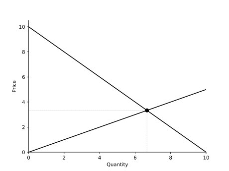
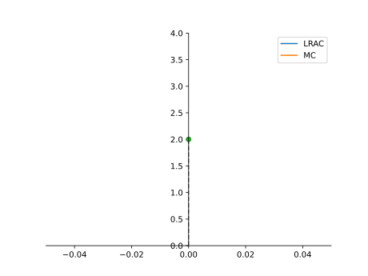
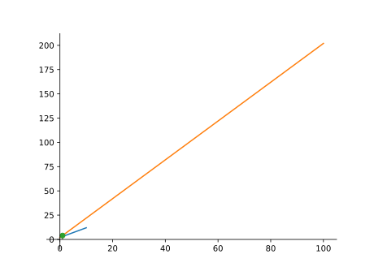
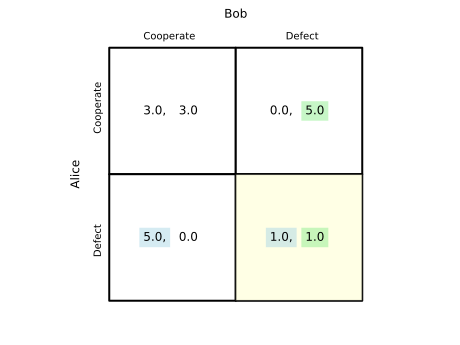
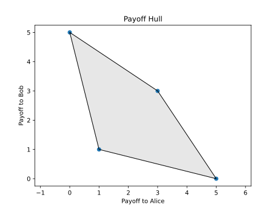
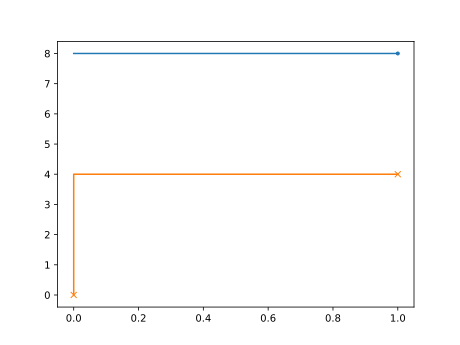
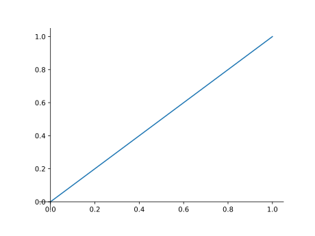

Plot Gallery
============

This gallery highlights the various objects in ``FreeRide`` that offer
plotting utilities. Each section provides a short code example showing how
to produce the plot.  All examples assume ``import matplotlib.pyplot as plt``
has already been executed.

Demand and Supply
-----------------

Demand and supply curves inherit plotting methods from the affine
base classes.  A simple demand and supply pair can be plotted as
follows::

    from freeride.curves import Demand, Supply

    D = Demand(12, -1)
    S = Supply(0, 1)
    ax = D.plot()
    S.plot(ax=ax)
    ax.figure.savefig("demand_supply.svg", transparent=True)
    plt.close(ax.figure)

Equilibrium
-----------

The :class:`~freeride.equilibrium.Equilibrium` class plots an entire
market diagram including dashed equilibrium lines.  The quickstart
example demonstrates basic usage::

    from freeride.curves import Demand, Supply
    from freeride.equilibrium import Equilibrium

    D = Demand.from_formula("Q = 10 - 1*P")
    S = Supply.from_formula("Q = 2*P")
    eq = Equilibrium(D, S)
    ax = eq.plot()
    ax.figure.savefig("equilibrium_gallery.svg", transparent=True)
    plt.close(ax.figure)

Production Possibilities Frontier
---------------------------------

The :class:`~freeride.curves.PPF` class can render either Matplotlib or
Bokeh output using the ``backend`` argument::

    from freeride.curves import PPF

    ppf = PPF(10, -1)
    ax = ppf.plot()             # Matplotlib by default
    ax.figure.savefig("ppf_gallery.svg", transparent=True)
    plt.close(ax.figure)
    bokeh_fig = ppf.plot(backend='bokeh')

Cost Curves
-----------

Cost objects provide two higher level plotting helpers.  ``long_run_plot``
shows LRAC and MC curves while ``cost_profit_plot`` highlights profit and
cost regions::

    from freeride.costs import Cost

    tc = Cost(0, 2, 1)
    tc.long_run_plot()
    plt.gcf().savefig("long_run_plot.svg", transparent=True)
    plt.close()

.. code-block:: python

    from freeride.costs import Cost

    tc = Cost(0, 2, 1)
    tc.cost_profit_plot(p=4)
    plt.gcf().savefig("cost_profit_plot.svg", transparent=True)
    plt.close()

Games
-----

Normal form games display payoff tables via ``table`` and can illustrate
the set of possible payoffs with ``plot_payoff_hull``::

    from freeride.games import Game

    g = Game.prisoners_dilemma()
    ax = g.table()
    ax.figure.savefig("game_table.svg", transparent=True)
    plt.close(ax.figure)

.. code-block:: python

    from freeride.games import Game

    g = Game.prisoners_dilemma()
    hull_ax = g.plot_payoff_hull()
    hull_ax.figure.savefig("game_payoff_hull.svg", transparent=True)
    plt.close(hull_ax.figure)

Double Auction
--------------

The :class:`~freeride.double_auction.DoubleAuction` class plots market
supply and demand schedules constructed from unit agents::

    from freeride.double_auction import UnitDemand, UnitSupply, DoubleAuction

    auction = DoubleAuction(UnitDemand(8), UnitSupply(4))
    ax = auction.plot()
    ax.figure.savefig("double_auction.svg", transparent=True)
    plt.close(ax.figure)

Long-Run Competitive Equilibrium
--------------------------------

:class:`~freeride.equilibrium.LongRunCompetitiveEquilibrium` draws side
by side firm and market diagrams::

    from freeride.curves import Demand
    from freeride.costs import Cost
    from freeride.equilibrium import LongRunCompetitiveEquilibrium

    demand = Demand(10, -1)
    cost = Cost(1, 0, 1)
    lr = LongRunCompetitiveEquilibrium(demand, cost)
    fig = lr.plot()
    fig.savefig("long_run_competitive_equilibrium.svg", transparent=True)
    plt.close(fig)

.. image:: long_run_competitive_equilibrium.svg
   :align: center
   :alt: Long-run competitive equilibrium

Plotting Utilities
------------------

``FreeRide`` also provides helper utilities in
:mod:`freeride.plotting`.  The :func:`textbook_axes` function positions
axes at the origin for a "textbook" look::

    import matplotlib.pyplot as plt
    from freeride.plotting import textbook_axes

    fig, ax = plt.subplots()
    ax.plot([0, 1], [0, 1])
    textbook_axes(ax)
    fig.savefig("textbook_axes.svg", transparent=True)
    plt.close(fig)

