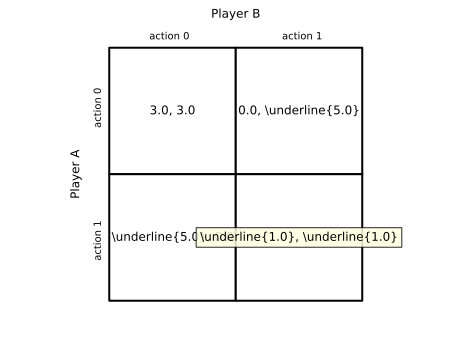
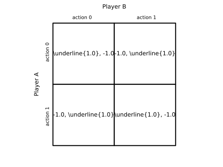
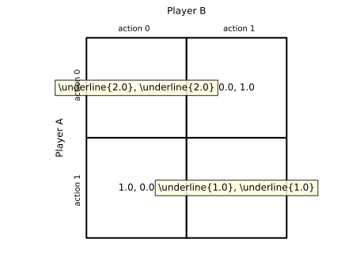
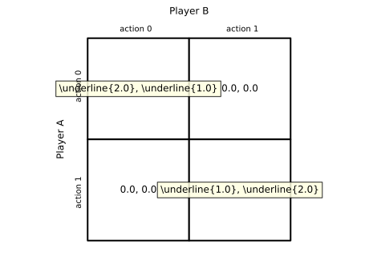
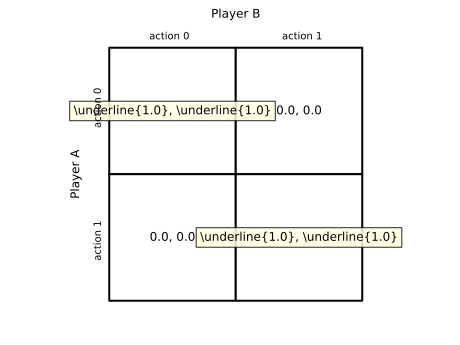
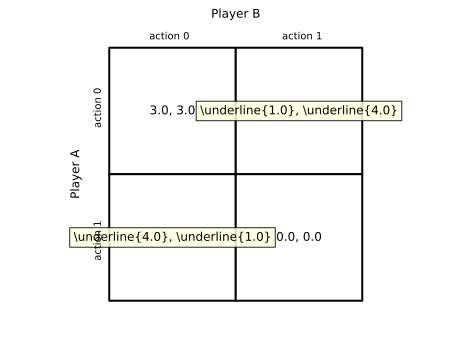

# Classic Games

This tutorial demonstrates how to create several well known 2x2 games using helper functions provided by `freeride`. Each game returns a `Game` instance with standard payoffs and we show the resulting payoff table using `.table()`.

## Prisoner's Dilemma
```python
from freeride.games import prisoners_dilemma

game = prisoners_dilemma()
print(game.nash_equilibria())
ax = game.table()
```



## Matching Pennies
```python
from freeride.games import matching_pennies

game = matching_pennies()
print(game.nash_equilibria())
ax = game.table()
```



## Stag Hunt
```python
from freeride.games import stag_hunt

game = stag_hunt()
print(game.nash_equilibria())
ax = game.table()
```



## Battle of the Sexes
```python
from freeride.games import battle_of_the_sexes

game = battle_of_the_sexes()
print(game.nash_equilibria())
ax = game.table()
```



## Pure Coordination
```python
from freeride.games import pure_coordination

game = pure_coordination()
print(game.nash_equilibria())
ax = game.table()
```



## Chicken
```python
from freeride.games import chicken

game = chicken()
print(game.nash_equilibria())
ax = game.table()
```


