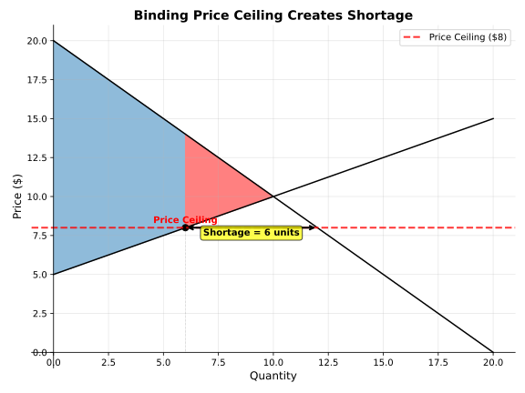
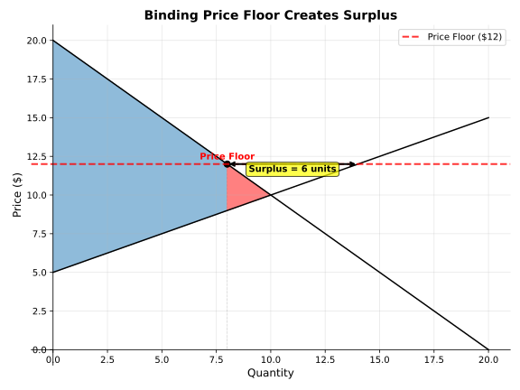

Price Controls
==============

.. raw:: html

   

     
     
   

The Concept
-----------

Price controls are government-imposed constraints on market prices:

- **Price Ceiling**: A legal maximum price (e.g., rent control)
- **Price Floor**: A legal minimum price (e.g., minimum wage)

When binding, price controls create market distortions:
- Binding ceilings (below equilibrium) create **shortages**
- Binding floors (above equilibrium) create **surpluses**
- Both generate **deadweight loss** by preventing mutually beneficial trades

Modeling with FreeRide
----------------------

Let's explore how price controls affect market outcomes:

.. code-block:: python

   from freeride.curves import Demand, Supply
   from freeride.equilibrium import Market

   # Create a market
   demand = Demand.from_formula("P = 20 - Q")
   supply = Supply.from_formula("P = 5 + 0.5*Q")
   
   # Find free market equilibrium
   free_market = Market(demand, supply)
   print(f"Free Market Equilibrium: P = ${free_market.p:.2f}, Q = {free_market.q:.0f}")
   print(f"Total Surplus: ${free_market.total_surplus:.2f}")

**Expected Output:**

.. code-block:: text

   Free Market Equilibrium: P = $10.00, Q = 10
   Total Surplus: $125.00

Price Ceilings
--------------

A binding price ceiling creates a shortage because quantity demanded exceeds quantity supplied:

.. code-block:: python

   # Apply a binding price ceiling at $8
   ceiling_market = Market(demand, supply, ceiling=8)
   
   # Calculate shortage
   q_demanded = demand.q(8)
   q_supplied = supply.q(8)
   shortage = q_demanded - q_supplied
   
   print(f"With Price Ceiling at $8:")
   print(f"  Quantity Supplied: {q_supplied:.0f}")
   print(f"  Quantity Demanded: {q_demanded:.0f}")
   print(f"  Shortage: {shortage:.0f} units")
   print(f"  Deadweight Loss: ${ceiling_market.dwl:.2f}")
   
   # Visualize the market with ceiling
   ceiling_market.plot(surplus=True)

**Expected Output:**

.. code-block:: text

   With Price Ceiling at $8:
     Quantity Supplied: 6
     Quantity Demanded: 12
     Shortage: 6 units
     Deadweight Loss: $8.00

The plot shows the binding ceiling creating a wedge between quantity supplied and demanded, 
with the red area representing deadweight loss.

Price Floors
------------

A binding price floor creates a surplus because quantity supplied exceeds quantity demanded:

.. code-block:: python

   # Apply a binding price floor at $12
   floor_market = Market(demand, supply, floor=12)
   
   # Calculate surplus
   q_demanded = demand.q(12)
   q_supplied = supply.q(12)
   surplus = q_supplied - q_demanded
   
   print(f"With Price Floor at $12:")
   print(f"  Quantity Demanded: {q_demanded:.0f}")
   print(f"  Quantity Supplied: {q_supplied:.0f}")
   print(f"  Surplus: {surplus:.0f} units")
   print(f"  Deadweight Loss: ${floor_market.dwl:.2f}")
   
   # Visualize the market with floor
   floor_market.plot(surplus=True)

**Expected Output:**

.. code-block:: text

   With Price Floor at $12:
     Quantity Demanded: 8
     Quantity Supplied: 14
     Surplus: 6 units
     Deadweight Loss: $8.00

The plot shows the binding floor creating excess supply, with producers unable to sell all 
they wish at the floor price.

Non-Binding Controls
--------------------

Price controls only affect the market when they're binding:

.. code-block:: python

   # Non-binding ceiling (above equilibrium)
   high_ceiling = Market(demand, supply, ceiling=15)
   print(f"Non-binding ceiling at $15: P = ${high_ceiling.p:.2f}, Q = {high_ceiling.q:.0f}")
   
   # Non-binding floor (below equilibrium)
   low_floor = Market(demand, supply, floor=7)
   print(f"Non-binding floor at $7: P = ${low_floor.p:.2f}, Q = {low_floor.q:.0f}")
   
   # Both should equal free market equilibrium
   print(f"Free market: P = ${free_market.p:.2f}, Q = {free_market.q:.0f}")

**Expected Output:**

.. code-block:: text

   Non-binding ceiling at $15: P = $10.00, Q = 10
   Non-binding floor at $7: P = $10.00, Q = 10
   Free market: P = $10.00, Q = 10

Welfare Analysis
----------------

Price controls reduce total surplus by preventing some mutually beneficial trades:

.. code-block:: python

   # Compare welfare across different scenarios
   scenarios = [
       ("Free Market", free_market),
       ("Price Ceiling ($8)", ceiling_market),
       ("Price Floor ($12)", floor_market)
   ]
   
   print("Welfare Comparison:")
   print("-" * 50)
   for name, market in scenarios:
       print(f"{name:20} CS: ${market.consumer_surplus:6.2f}  "
             f"PS: ${market.producer_surplus:6.2f}  "
             f"Total: ${market.total_surplus:6.2f}")
   print("-" * 50)
   print(f"DWL from ceiling: ${ceiling_market.dwl:.2f}")
   print(f"DWL from floor: ${floor_market.dwl:.2f}")

**Expected Output:**

.. code-block:: text

   Welfare Comparison:
   --------------------------------------------------
   Free Market          CS: $ 50.00  PS: $ 75.00  Total: $125.00
   Price Ceiling ($8)   CS: $ 66.00  PS: $ 51.00  Total: $117.00
   Price Floor ($12)    CS: $ 32.00  PS: $ 85.00  Total: $117.00
   --------------------------------------------------
   DWL from ceiling: $8.00
   DWL from floor: $8.00

Notice how price controls redistribute surplus between consumers and producers while 
reducing total welfare.

Try It Yourself
---------------

Click the **"Open in Colab"** button above to run this example interactively! You can:

1. Experiment with different ceiling and floor prices
2. See how the size of shortage/surplus depends on the control level
3. Compare deadweight loss from different interventions
4. Explore how elasticity affects the impact of price controls

**Next:** Learn about taxes and their effects in the market equilibrium tutorial!