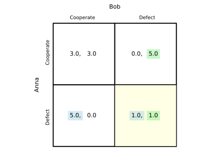

The Prisoner's Dilemma
======================

.. raw:: html

   

     
     
   

The Prisoner's Dilemma is one of the most famous games. It illustrates how two 
players might not cooperate even when it would be in their collective interest to do so.

The Scenario
------------

Two prisoners are arrested and held in separate cells. They cannot communicate with each other and the game is only played once. 
Each has two options:

- **Cooperate** (remain silent)  
- **Defect** (betray the other)

The payoffs represent utility (higher numbers are better):

- If both cooperate: Both get utility of 3 (mutual cooperation reward)
- If both defect: Both get utility of 1 (mutual punishment)  
- If one cooperates and one defects: The cooperator gets 0 (sucker's payoff), the defector gets 5 (temptation payoff)

Modeling with FreeRide
----------------------

Let's model this game using FreeRide's game theory tools:

.. code-block:: python

   from freeride.games import Game

   game = Game.prisoners_dilemma()
   ax = game.table()
   print(game.nash())

**Expected Output:**

.. code-block:: text

   [('Defect', 'Defect')]

The visual game table will also be displayed, showing the Nash equilibrium as the actual 
strategy profile with action names.

Try It Yourself
---------------

Click the **"Open in Colab"** button above to run this example interactively! You can:

1. Modify the payoff values to see how they affect the equilibrium
2. Try different scenarios (what if cooperation paid more?)
3. Explore other classic games available in FreeRide

**Next:** Explore more economics concepts with FreeRide!